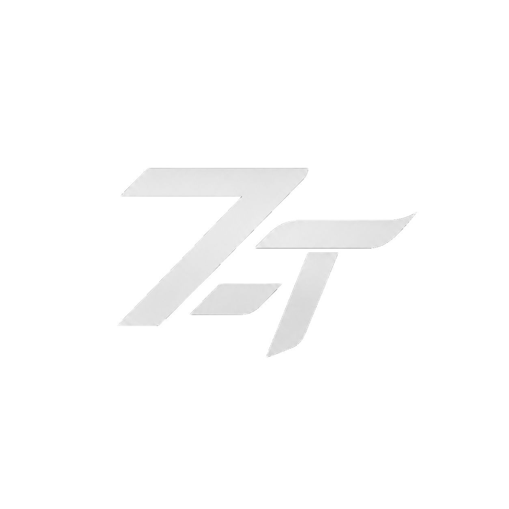

<div align="center">



<br>

# Zexta Launcher

**Next-gen Minecraft launcher with Vision Pro–inspired Liquid Glass UI**

[](https://github.com/phumitchreal/Frontline-Project)
[](https://v2.tauri.app)
[](https://react.dev)
[](https://www.rust-lang.org)
[](https://vite.dev)
[](https://www.typescriptlang.org)

<br>

<sup>
Built with Tauri 2.0 (Rust) for a blazing-fast, cross-platform desktop experience.
<br>
Powered by React 19 with a stunning Liquid Glass design system.
</sup>

<br>
<br>

[<kbd> <br> 📥 Download <br> </kbd>](https://github.com/phumitchreal/Frontline-Project/releases)&nbsp;&nbsp;
[<kbd> <br> 💬 Discord <br> </kbd>](https://discord.gg/frontline)&nbsp;&nbsp;
[<kbd> <br> 🌐 Website <br> </kbd>](https://frontline-project.com)

</div>

<br>

## ✨ Features

<table>
<tr>
<td width="50%">

### 🪟 Liquid Glass UI
Apple Vision Pro–inspired design with **3-layer glassmorphism**,
80px depth blur, ambient gradient orbs, and glass cards
with hover lift + accent-colored shadows.

</td>
<td width="50%">

### 🎨 6 Accent Themes
Fully customizable accent color system —
**Blue · Purple · Green · Orange · Red · Mono**.
All themes with RGB variables for dynamic glows and colored shadows.

</td>
</tr>
<tr>
<td width="50%">

### 🚀 One-Click Launch
Modpack auto-install with **Fabric** support.
Minecraft 1.21.1 ready. Download, sync mods,
and start playing — all in one click.

</td>
<td width="50%">

### 💻 Cross-Platform
Native desktop performance on **Windows · macOS · Linux**
via Tauri 2.0 (Rust backend). Tiny bundle size, low memory footprint.

</td>
</tr>
<tr>
<td width="50%">

### 🔐 Microsoft Auth
Secure Microsoft OAuth login with profile sync.
**Discord Rich Presence** integration to show your status
while playing on the Zexta server.

</td>
<td width="50%">

### 🌏 Thai & English
Full bilingual interface — ทั้งภาษาไทยและอังกฤษ.
Every UI string, tooltip, and status message
is translated and ready.

</td>
</tr>
</table>

<br>

## 🎨 Theme System

Configure in **Settings → Appearance** — persisted in `localStorage`.

<div align="center">

| Theme | Hex | Preview |
|:------|:---:|:-------:|
| **Blue** | `#007AFF` |  |
| **Purple** | `#5856D6` |  |
| **Green** | `#34C759` |  |
| **Orange** | `#FF9500` |  |
| **Red** | `#FF3B30` |  |
| **Mono** | `#8E8E93` |  |

</div>

<br>

## 🏗️ Architecture

```
┌─────────────────────────────────────────────────────────────┐
│                        Zexta Launcher                       │
├──────────────────────────┬──────────────────────────────────┤
│      Frontend (Web)      │        Backend (Native)          │
│                          │                                  │
│  React 19 + TypeScript   │   Tauri 2.0 Core (Rust)         │
│  Vite 8 (HMR / Build)   │   ├─ Minecraft Process Mgmt     │
│  Tailwind CSS v4         │   ├─ File System & Downloads    │
│  LINE Seed Sans TH       │   ├─ Microsoft OAuth Flow       │
│                          │   └─ Discord RPC Bridge          │
├──────────────────────────┴──────────────────────────────────┤
│            WebView (Tauri WRY) · IPC Bridge                 │
├─────────────────────────────────────────────────────────────┤
│  Windows (WebView2)  │  macOS (WebKit)  │  Linux (WebKitGTK)│
└─────────────────────────────────────────────────────────────┘
```

<br>

## 📂 Project Structure

```
Zexta-Launcher/
├── src/                        # Frontend source
│   ├── App.tsx                 # Main UI — dashboard, settings, modals
│   ├── config.ts               # Launcher config (version, URLs, changelog)
│   ├── index.css               # Tailwind + theme variables + glass animations
│   └── main.tsx                # React DOM entry point
│
├── src-tauri/                  # Tauri / Rust backend
│   ├── src/
│   │   └── main.rs             # Rust commands & system APIs
│   ├── Cargo.toml              # Rust dependencies
│   └── tauri.conf.json         # Tauri window & build config
│
├── public/                     # Static assets
│   ├── zexta-logo.png          # App logo
│   ├── favicon.ico             # Window icon
│   └── login-popup.html        # OAuth popup page
│
├── index.html                  # Vite entry HTML
├── vite.config.ts              # Vite configuration
├── tailwind.config.cjs         # Tailwind CSS config
├── tsconfig.json               # TypeScript config
└── package.json                # npm scripts & dependencies
```

<br>

## ⚡ Quick Start

### Prerequisites

| Tool | Version | Install |
|:-----|:--------|:--------|
| **Node.js** | ≥ 18 | [nodejs.org](https://nodejs.org/) |
| **Rust** | latest stable | [rustup.rs](https://rustup.rs/) |
| **Tauri CLI** | v2 | [tauri.app/start](https://v2.tauri.app/start/cli/) |

### Development

```bash
# 1. Clone the repository
git clone https://github.com/phumitchreal/Frontline-Project.git
cd Zexta-Launcher

# 2. Install dependencies
npm install

# 3. Start dev server with hot reload
npm run dev

# 4. Run the desktop app in dev mode
npm run tauri:dev
```

### Production Build

```bash
# Build web frontend only
npm run build

# Build full desktop app (installer + executable)
npm run tauri:build
```

**Build output:**

| Path | Description |
|:-----|:------------|
| `dist/` | Static web build |
| `src-tauri/target/release/` | Desktop executable |

<br>

## 🛠️ Tech Stack

<div align="center">

| Layer | Technology | Role |
|:------|:-----------|:-----|
| **Frontend** | React 19 · TypeScript | Component UI |
| **Bundler** | Vite 8 | Dev server & build |
| **Styling** | Tailwind CSS v4 | Utility-first CSS |
| **Desktop** | Tauri 2.0 (Rust) | Native shell & APIs |
| **Auth** | Microsoft OAuth | Minecraft account |
| **Social** | Discord RPC | Rich presence |
| **Icons** | Lucide React | UI iconography |
| **Font** | LINE Seed Sans TH | Thai/Latin typeface |

</div>

<br>

## 📋 Changelog

### `v2.6.0` — Vision Pro Redesign
> 🗓️ 2025-07-09

- ✅ Apple Vision Pro–inspired **3-layer glass UI** (80px blur)
- ✅ Ambient gradient orbs with slow float animation
- ✅ Glass cards with hover lift + accent-colored shadow
- ✅ RGB accent variables for dynamic colored glows
- ✅ Full **Thai language** support across all UI
- ✅ Game log display during active gameplay
- ✅ Premium button system with press feedback

<details>
<summary><b>v2.5.0</b> — EX1: Unless &nbsp;<code>2025-03-23</code></summary>
<br>

- Enhanced system optimization for better performance
- Improved launcher UI/UX with better accessibility
- Cross-platform support (Windows, macOS, Linux)
- Java 21 auto-installation for all platforms
- Better error handling and crash recovery
- Bug fixes for mod synchronization

</details>

<details>
<summary><b>v2.4.0</b> — Stability & Performance &nbsp;<code>2024-03-18</code></summary>
<br>

- Initial Launcher Release
- Basic Minecraft launcher functionality
- Modpack integration with Fabric support
- User authentication and profile management
- Discord RPC integration

</details>

<br>

## 🤝 Contributing

Contributions are welcome! Feel free to open an issue or submit a pull request.

```bash
# Fork → Clone → Branch → Code → PR
git checkout -b feature/your-feature
git commit -m "feat: add your feature"
git push origin feature/your-feature
```

<br>

## 📄 License

This project is developed by **Zexta Project**.

<br>

---

<div align="center">


<br>

**Zexta Project** · 2024 – 2025

[Discord](https://discord.gg/frontline) · [Website](https://frontline-project.com)

<br>

<sub>Made with ❤️ and a lot of ☕</sub>

</div>
